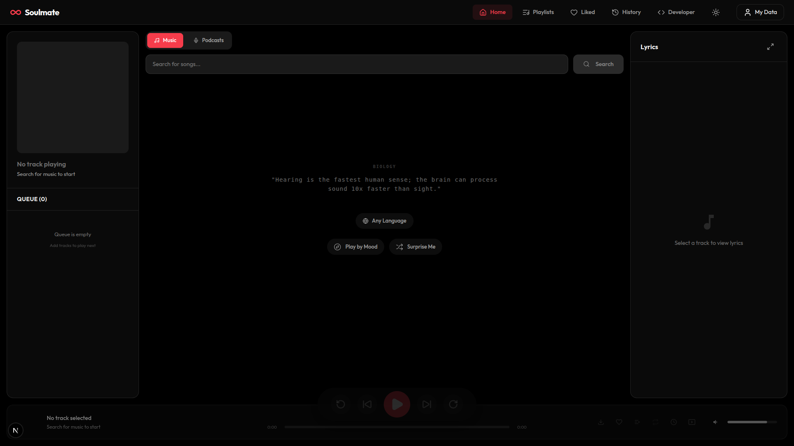
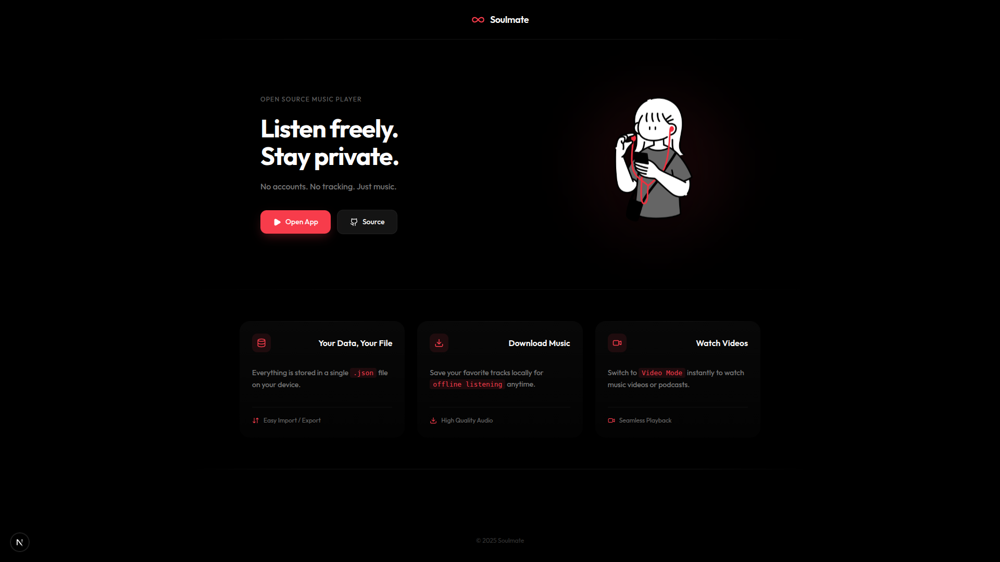
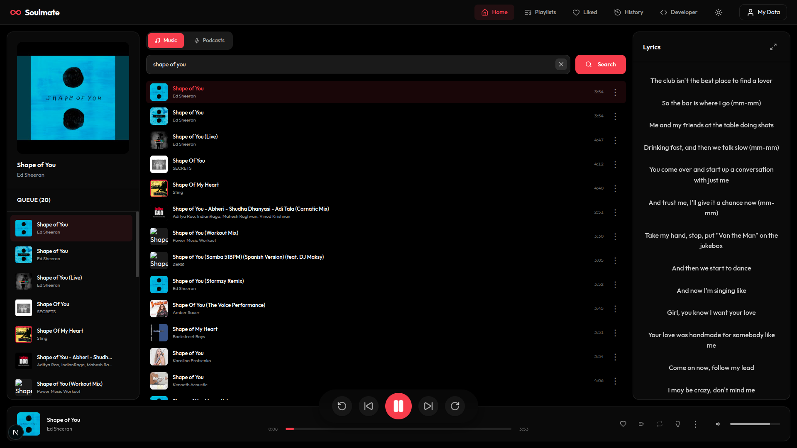
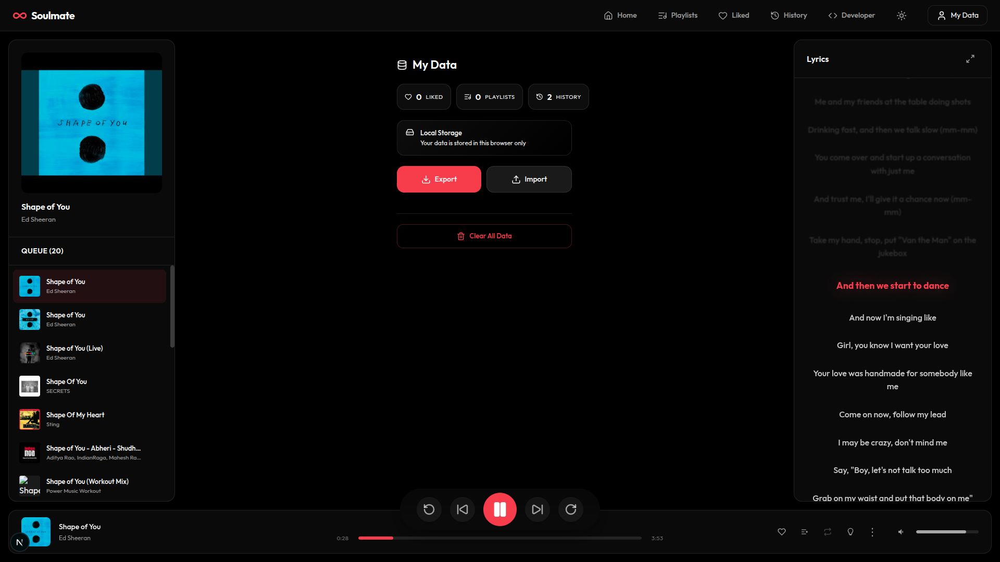
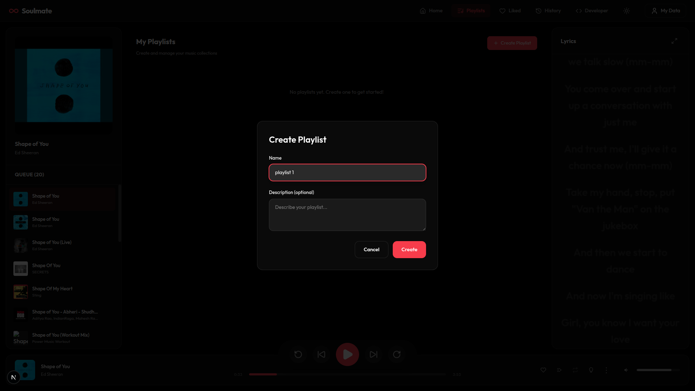
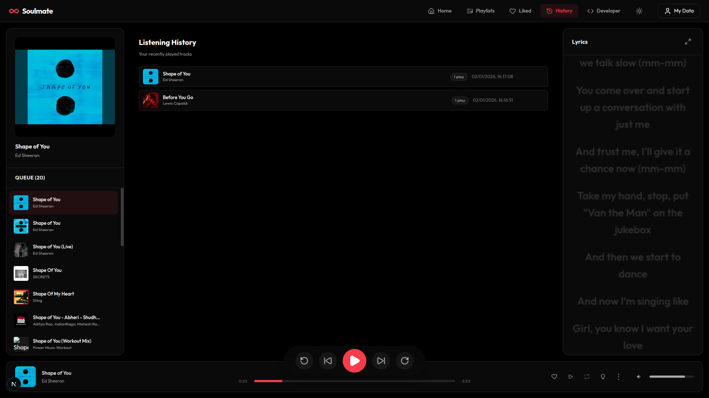
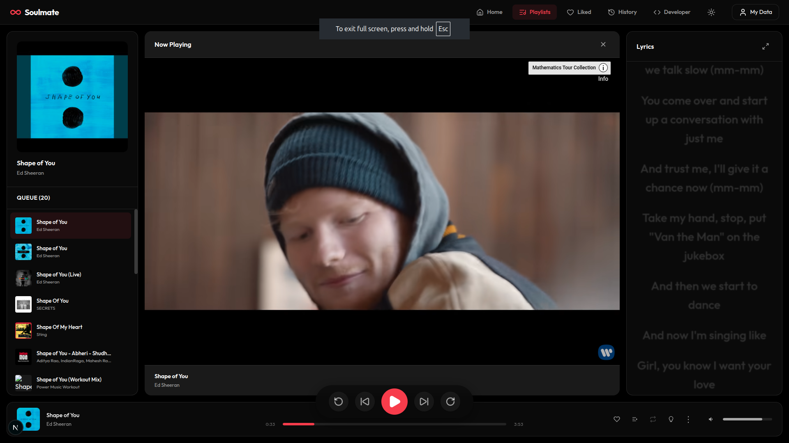
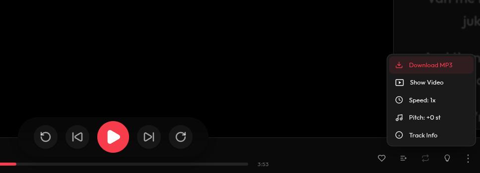

# Soulmate - Your Personal Music Companion

Soulmate is a modern, aesthetic music player web application designed to bring your favorite tunes to life. With a sleek user interface and powerful backend, it offers a seamless listening experience.



## Features

*   **Beautiful UI**: A polished, responsive interface with smooth animations and a premium feel.
*   **Music Streaming**: Stream your favorite songs with high-quality audio.
*   **Lyrics Integration**: View synchronized lyrics while you listen.
*   **Playlist Management**: Create and manage your personal playlists.
*   **Search**: Powerful search functionality to find songs, artists, and albums.
*   **Cross-Platform**: Runs on Windows, macOS, and Linux.

## Prerequisites

Before you begin, ensure you have the following installed on your system:

1.  **Node.js**: Required to run the client and server.
    *   **Download**: [nodejs.org](https://nodejs.org/) (Version 18 or higher recommended).
2.  **Python**: Required by `yt-dlp`.
    *   **Download**: [python.org](https://www.python.org/downloads/).
3.  **yt-dlp**: A command-line program to download videos/audio from YouTube.
    *   **Installation**:
        *   **Windows/Linux/macOS**: If you have Python installed, run:
            ```bash
            pip install yt-dlp
            ```
        *   Alternatively, see the [official installation guide](https://github.com/yt-dlp/yt-dlp#installation) for binary downloads.


## Installation

Follow these steps to set up the project locally.

### 1. Clone the Repository

Open your terminal (Command Prompt, PowerShell, or Terminal) and run:

```bash
git clone https://github.com/AlokMahapatra26/soulmate-mono.git
cd soulmate-mono
```

### 2. Install Server Dependencies

Navigate to the server directory and install the required packages:

```bash
cd server
npm install
```

### 3. Install Client Dependencies

Open a new terminal tab or navigate back to the root and then to the client directory:

```bash
cd ../client
npm install
```

## Running the Application

You need to run both the **Server** and the **Client** simultaneously.

### Step 1: Start the Backend Server

In your terminal, inside the `server` directory, run:

```bash
npm run dev
```
*You should see a message indicating the server is running (e.g., "Server listening on port 3001").*

### Step 2: Start the Frontend Client

Open a **new terminal window/tab**, navigate to the `client` directory, and run:

```bash
npm run dev
```
*The client will start, usually accessible at `http://localhost:3000`.*

### Step 3: Open in Browser

Open your web browser and go to:
[http://localhost:3000](http://localhost:3000)

## Screenshots

### Landing Page


### Home Page


### Music Player


### Profile Export Import


### Read Lrycis and sing along


### Playlist


### History


### Video Play


### Download Song


## Troubleshooting

*   **`yt-dlp` not found**: Ensure `yt-dlp` is installed and added to your system's PATH. You can test this by typing `yt-dlp --version` in your terminal.

*   **Port Conflicts**: If port 3000 or 3001 is in use, you may need to kill the process using that port or configure the app to use different ports.

## License

[MIT License](LICENSE)
